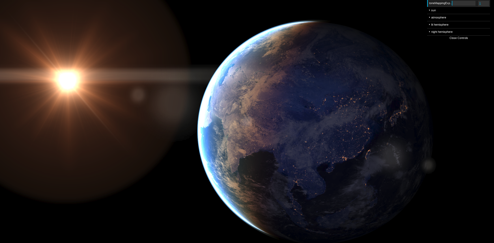

# three-planets

Good looking planets in ThreeJS [in progress].



## Installation

```bash
git clone git@github.com:Astrak/three-planets
cd three-planets
yarn
yarn start
```

This starts a server on port 8080 showing a scene as in the picture.

## Use

```typescript
import { Planet, PlanetMaterial, PlanetAtmosphere } from "three-planets";

const star = new THREE.DirectionalLight(0xffffff, 15, 0);
star.position.set(5, 0, 0);

const earth = new THREE.Planet({
    planetRadius: 1,
    atmosphereRadius: 1.015,
    atmosphereAltitudeOfAverageDensity: 0.47,
    albedoMap: textureLoader.load("textures/land2_8192.png", filterLinear),
    bumpMap: textureLoader.load("textures/bump.jpg", filterLinear),
    specularMap: textureLoader.load("textures/specular.png", filterLinear),
    cloudMap: textureLoader.load("textures/clouds.jpg", filterLinear),
    emissiveMap: textureLoader.load("textures/ground4096.jpg", filterLinear),
    cloudPatternMap: textureLoader.load(
        "textures/cloudpattern2.jpg",
        repeatWrapping
    ),
    cityMap: textureLoader.load("textures/city3.jpg", repeatWrapping),
    cityMask: textureLoader.load("textures/cities_4096.jpg", repeatWrapping),
    suburbsMask: textureLoader.load(
        "textures/suburbs512-2.jpg",
        repeatWrapping
    ),
});
earth.sun = star;

scene.add(earth, star);

// Used for small textures multiplying the color of the base ones and used to increase details.
function repeatWrapping(texture: THREE.Texture) {
    texture.wrapS = texture.wrapT = THREE.RepeatWrapping;
}

// Used to maintain details, especially for cloud shadows in the distance.
function filterLinear(texture: THREE.Texture) {
    texture.minFilter = THREE.LinearFilter;
}
```

## Todo.

-   LOD bump
-   cloud bump/normal
-   handle shadow (moons, eclipse)
-   tile mapping for much bigger textures (blue marble)
-   handle auroras
-   extend shader chunk and write shader as chunks. Support other rendering chunks like tone mapping.
-   inside view fix
-   clearer MIE and Rayleigh
-   way to set color from gas composition ?
-   average density altitude : fix. On earth it should be 5km...
-   onBeforeRender workaround?
